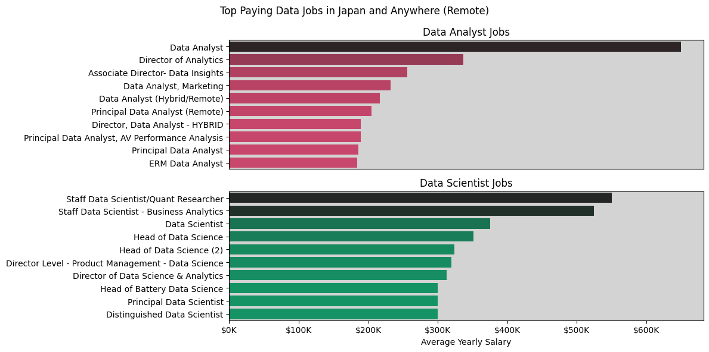
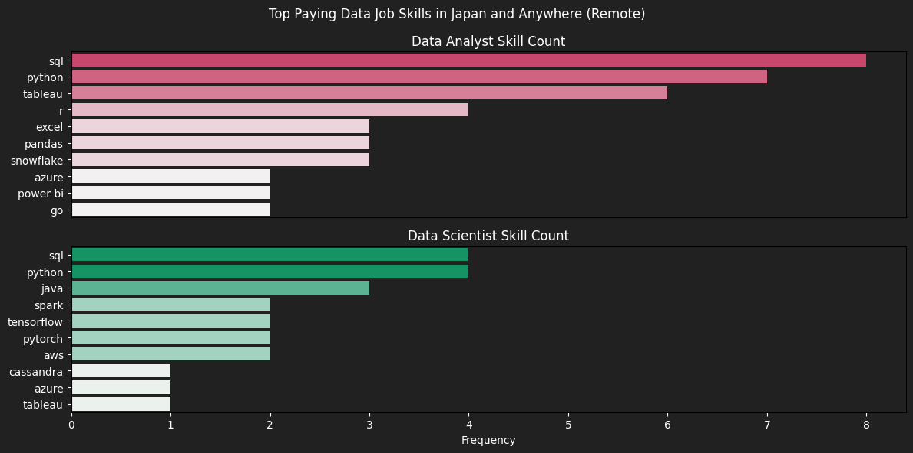
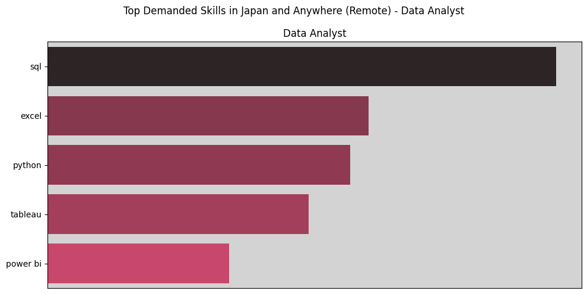
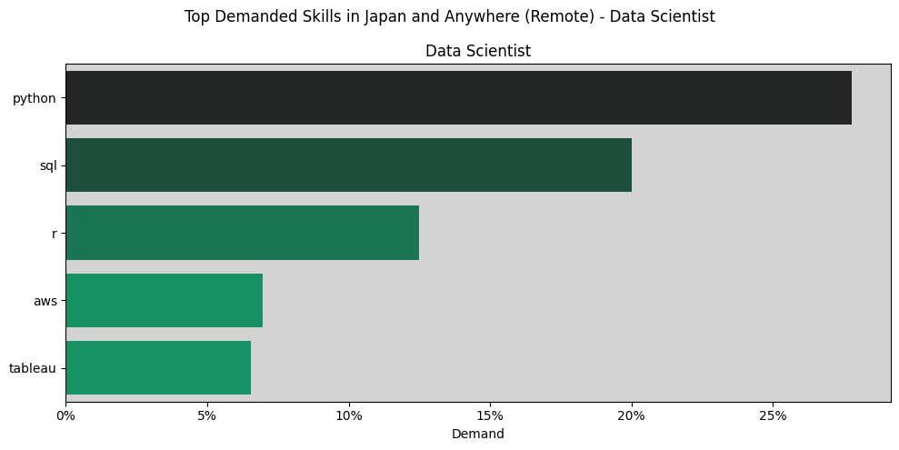
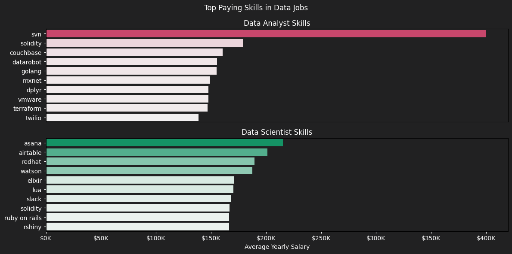
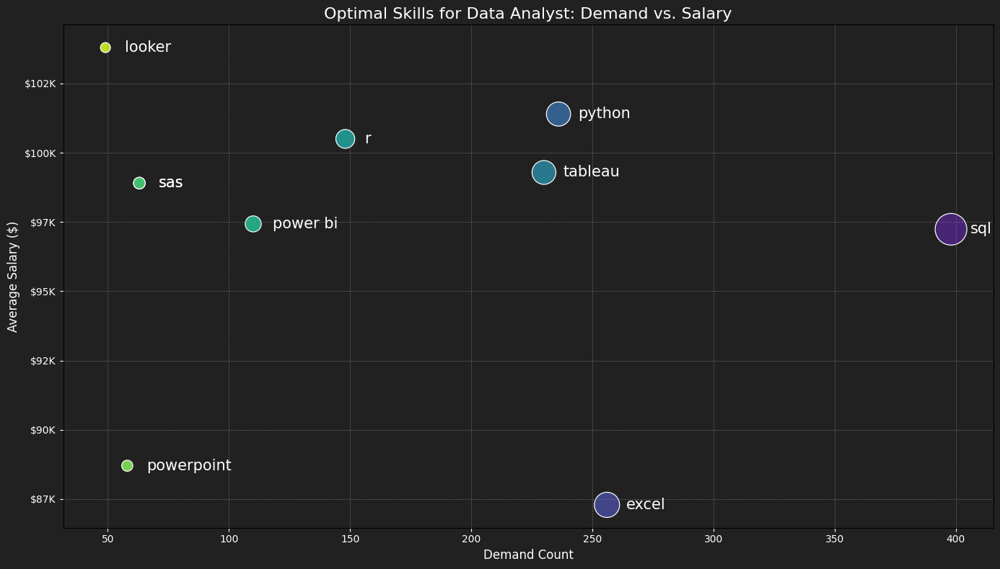
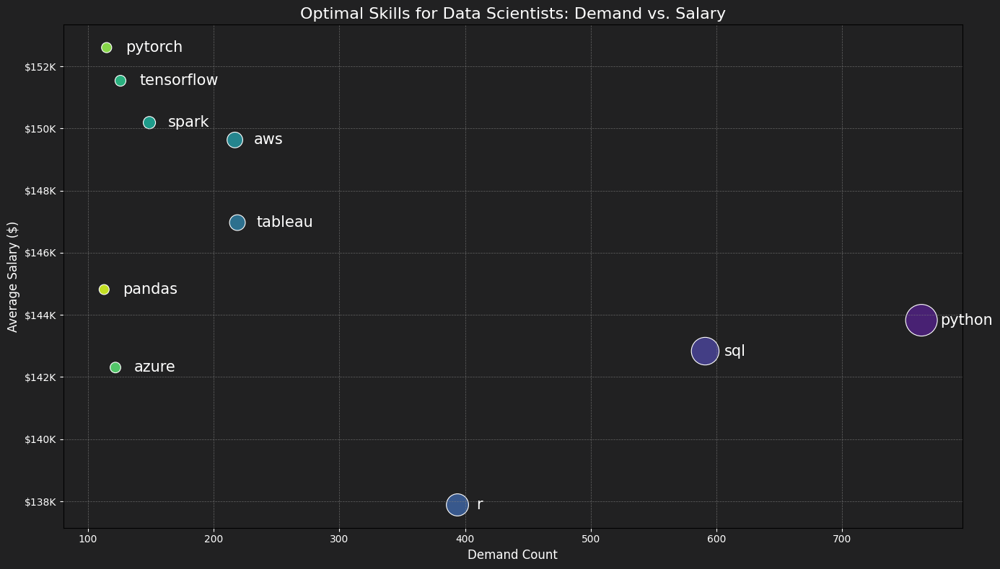

## SQL Job Posting Analysis
# Introduction
## Welcome to my Repository
In this project, SQL is used to analyze job posting datasets and visualize the results in Python. This project explores top-paying jobs, in-demand skills, and where high demand meets high salary in data analytics.

## Disclaimer
This project uses Luke Barousse [Datanerd](https://datanerd.tech/) datasets. This project analysis approach was inspired by Luke Barousse's YouTube course.

## Questions
1. What are the top-paying data analyst and data scientist jobs?
2. What skills are required for these top-paying jobs?
3. What skills are most in demand for data analysts and data scientists?
4. Which skills are associated with higher salaries?
5. What are the most optimal skills to learn?

## Tools
- SQL
- PostgreSQL
- Google Colab
- Python
- VS Code
- Git and GitHub

# The Analysis
Each query focuses on a particular aspect of the data analyst and data scientist job market. Below is an overview of how each question was analyzed:

## 1. What are the top-paying data analyst and data scientist jobs?
This query filters data analyst and data scientist roles by average yearly salary and location, focusing on jobs with remote positions to identify the highest-paying opportunities.

```sql
SELECT
    job_id,
    job_title,
    job_location,
    job_schedule_type,
    salary_year_avg,
    job_posted_date,
    name AS company_name
FROM 
    job_postings_fact
LEFT JOIN company_dim ON job_postings_fact.company_id = company_dim.company_id
WHERE
    (job_title_short = 'Data Analyst') AND
    (job_location = 'Japan' OR job_location = 'Anywhere') AND
    salary_year_avg IS NOT NULL
ORDER BY salary_year_avg DESC
LIMIT 10;
-- For Data Scientist, just change the 'Data Analyst'
```



### Insight
- Although some Data Analyst positions can offer higher salaries than Data Scientist roles, Data Scientist positions tend to provide higher overall compensation.
- There is substantial role diversity within both Data Analyst and Data Scientist careers, reflecting varied responsibilities, specializations, and career paths within the data field.
- Leadership and specialized positions dominate the top-paying roles in both tracks, showing that seniority and domain expertise significantly impact compensation.

## 2. What skills are required for these top-paying jobs?
To identify the skills required for the highest-paying jobs, Job posting data and skills data are combined to uncover what employers prioritize in well-compensated positions.

```sql
WITH top_paying_jobs AS (

SELECT
    job_id,
    job_title,
    salary_year_avg,
    name AS company_name
FROM 
    job_postings_fact
LEFT JOIN company_dim ON job_postings_fact.company_id = company_dim.company_id
WHERE
    (job_title_short = 'Data Scientist') AND
    (job_location = 'Anywhere' OR job_location = 'Japan') AND
    salary_year_avg IS NOT NULL
ORDER BY
    salary_year_avg DESC
LIMIT 10
)

SELECT top_paying_jobs.*,
       skills_dim.skills
FROM top_paying_jobs
INNER JOIN skills_job_dim ON top_paying_jobs.job_id = skills_job_dim.job_id
INNER JOIN skills_dim ON skills_job_dim.skill_id = skills_dim.skill_id
ORDER BY top_paying_jobs.salary_year_avg DESC;
-- For Data Analyst, just change the 'Data Scientist'
```



### Insight
- SQL and Python are the most important skills to have for Data Analyst and Data Scientist with high salary income.
- Data Analyst roles emphasize business intelligence and analytics tools, such as Tableau, Excel, and Power BI, highlighting a stronger focus on reporting and decision support.
- Data Scientist roles prioritize engineering and machine learning skills, including Spark, TensorFlow, and PyTorch, reflecting deeper involvement in large-scale data processing and model development.

## 3. What skills are most in demand for data analysts and data scientists?
This query identified the most frequently requested skills in job postings, highlighting areas of high demand.

```sql
SELECT 
    skills,
    COUNT(skills_job_dim.job_id) AS demand_count
FROM job_postings_fact
INNER JOIN skills_job_dim ON job_postings_fact.job_id = skills_job_dim.job_id
INNER JOIN skills_dim ON skills_job_dim.skill_id = skills_dim.skill_id
WHERE 
    job_title_short = 'Data Analyst' AND
    (job_location = 'Anywhere' OR job_location = 'Japan')
GROUP BY skills
ORDER BY demand_count DESC
LIMIT 10;
-- For Data Scientist, just change the 'Data Analyst'
```




### Insight
- SQL and Python remain the most in-demand skills across both roles, reinforcing their status as foundational competencies in data careers.
- Data Analyst demand is strongly skewed toward SQL and Excel, highlighting a focus on data extraction, reporting, and business analysis.
- Data Scientist roles prioritize Python more heavily than SQL, reflecting greater emphasis on modeling, experimentation, and advanced analytics.
- Data Analysts focus more on visualization tools (Tableau, Power BI), whereas Data Scientists are more in demand for cloud skills (AWS), indicating distinct roles and responsibilities.

## 4. Which skills are associated with higher salaries?
Examining average salaries by skill showed which skills are the most highly paid.

```sql
SELECT 
    skills,
    ROUND(AVG(salary_year_avg), 0) AS avg_salary
FROM job_postings_fact
INNER JOIN skills_job_dim ON job_postings_fact.job_id = skills_job_dim.job_id
INNER JOIN skills_dim ON skills_job_dim.skill_id = skills_dim.skill_id
WHERE 
    job_title_short = 'Data Scientist' AND
    salary_year_avg IS NOT NULL
GROUP BY skills
ORDER BY avg_salary DESC
LIMIT 10;
-- For Data Analyst, just change the 'Data Scientist'
```



### Insight
- High-paying skills tend to be niche and specialized rather than core analytics tools, indicating that rare or domain-specific expertise commands higher compensation.
- High-paying Data Analyst roles favor infrastructure and DevOps-related skills, while high-paying Data Scientist roles require broader technical expertise across platforms, languages, and enterprise tools.

## 5. What are the most optimal skills to learn?
By combining demand and salary insights, this query identified skills that are both in high demand and have high salaries, helping guide strategic skill development.

```sql
-- Identifies skills in high demand for Data Analyst roles
-- Use Query #3
WITH skills_demand AS (

    SELECT 
        skills_dim.skill_id,
        skills_dim.skills,
        COUNT(skills_job_dim.job_id) AS demand_count
    FROM job_postings_fact
    INNER JOIN skills_job_dim ON job_postings_fact.job_id = skills_job_dim.job_id
    INNER JOIN skills_dim ON skills_job_dim.skill_id = skills_dim.skill_id
    WHERE 
        job_title_short = 'Data Analyst' AND
        salary_year_avg IS NOT NULL AND
        job_work_from_home = True
    GROUP BY skills_dim.skill_id


), 
-- Skills with high average salaries for Data Analyst roles
-- Use Query #4
average_salary AS(

    SELECT 
        skills_dim.skill_id,
        skills_dim.skills,
        AVG(salary_year_avg) AS avg_salary
    FROM job_postings_fact
    INNER JOIN skills_job_dim ON job_postings_fact.job_id = skills_job_dim.job_id
    INNER JOIN skills_dim ON skills_job_dim.skill_id = skills_dim.skill_id
    WHERE 
        job_title_short = 'Data Analyst' AND
        salary_year_avg IS NOT NULL AND
        job_work_from_home = True
    GROUP BY skills_dim.skill_id

)

-- Return high demand and high salaries for 10 skills 

SELECT 
    skills_demand.skill_id,
    skills_demand.skills,
    demand_count,
    ROUND(avg_salary, 0) AS salary_avg
FROM skills_demand
INNER JOIN average_salary ON skills_demand.skill_id = average_salary.skill_id
ORDER BY
    demand_count DESC,
    salary_avg DESC
LIMIT 10;
-- For Data Scientist, just change the 'Data Analyst'
```




### Insight
#### Data Analyst
- SQL and Python sit at the optimal intersection of high demand and strong compensation, making them the most valuable foundational skills for Data Analysts.
- While Excel is highly demanded, it offers lower salary returns, serving more as a baseline requirement than a differentiating skill.
- Tableau provides a solid balance of demand and salary, while Looker and R offer higher salary potential as more specialized, differentiating skills.

#### Data Scientist
- Python and SQL dominate in demand, confirming their role as core, non-negotiable skills for Data Scientists.
- Despite lower demand, PyTorch and TensorFlow offer higher salaries, reflecting their importance in specialized and advanced roles.
- Big data and cloud skills such as Spark and AWS offer strong salary outcomes with moderate demand, making them strategic skills for long-term career growth.

## Thanks for Coming

